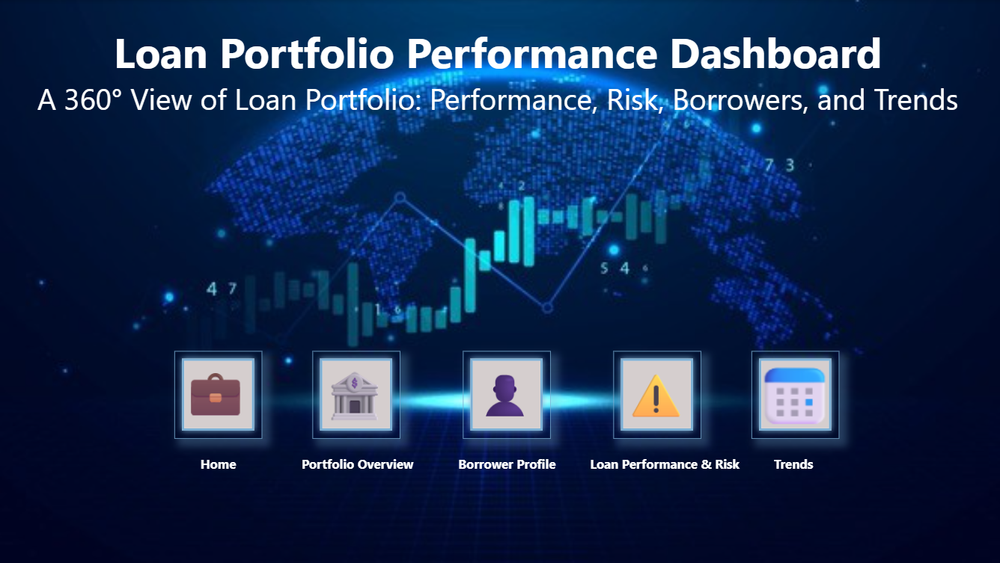
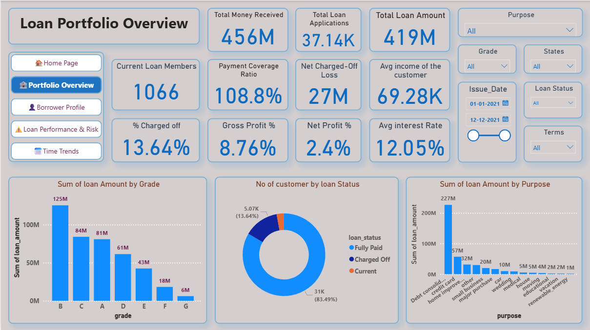
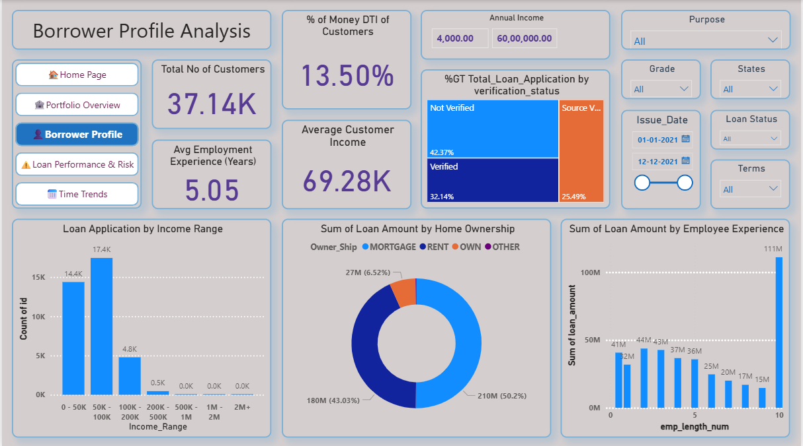
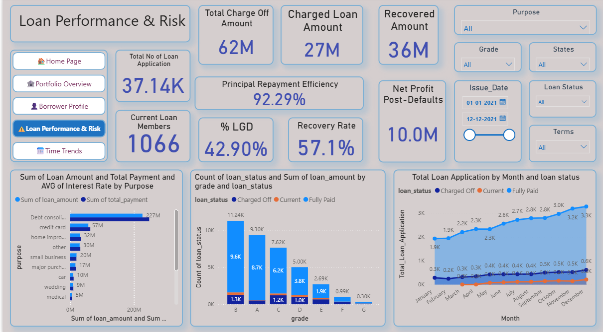
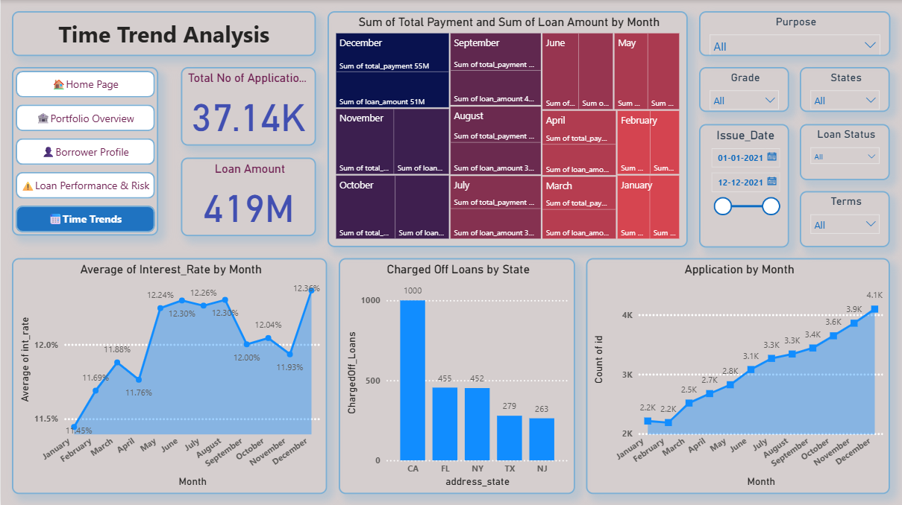

# 📊 Loan Portfolio Performance Dashboard  

A **360° Interactive Dashboard** built using **Python, Power BI, and DAX** to analyze loan portfolios, borrower profiles, risk metrics, and timeline trends.  
This project helps financial institutions and analysts monitor loan health, identify risks, and make data-driven decisions.  

---

## 🚀 Features  

- 🏦 **Portfolio Overview** – Track total loans, applications, profit, interest rates, and loan distribution by grade, purpose, and status.  
- 👥 **Borrower Profile** – Analyze customer demographics, income ranges, employment experience, and verification status.  
- ⚠️ **Loan Performance & Risk** – Monitor defaults, recoveries, repayment efficiency, LGD, and recovery rates.  
- 📈 **Trends** – Visualize time-based patterns in loan applications, payments, defaults, and interest rates.  

---

## 📂 Dashboard Pages  

1. **Portfolio Overview** – High-level KPIs and repayment insights.  
2. **Borrower Profile** – Borrower segmentation and behavioral analysis.  
3. **Loan Performance & Risk** – Default tracking, recovery analysis, and efficiency metrics.  
4. **Trends** – Time-series analysis of applications, payments, and risks.  

---

## 🛠️ Tech Stack  

- **Python** – Data preprocessing & transformation  
- **Power BI** – Dashboard development & visualization  
- **DAX (Data Analysis Expressions)** – Custom calculations & KPIs  

---

## 📸 Screenshots  

| Home Page | Portfolio Overview | Borrower Profile |  
|-----------|--------------------|------------------|  
|  |  |  |  

| Loan Performance & Risk | Time Trends |  
|--------------------------|-------------|  
|  |  |  

---

## 📌 Key Insights  

- Debt consolidation loans dominate the portfolio.  
- Higher defaults are observed in lower-grade loans (E, F, G).  
- Most borrowers fall into the **50K–100K annual income** range.  
- Repayment efficiency is strong at **92%+**, but charge-offs highlight risks in certain states.  
- Loan applications show an **upward monthly trend** with seasonal variations.  

---

## 📌 Key Insights  

- 📊 **Total Loan Applications:** 37K+  
- 💰 **Total Loan Amount Issued:** 419M  
- 💵 **Total Money Recovered:** 456M  
- 📉 **Net Charged-Off Loss:** 28M  
- 📈 **True Profit (Risk-Adjusted):** 9M (**2.06%**)  
- 🏦 **Repayment Efficiency:** ~92%  
- ⚠️ **Charged-Off Accounts:** 5.3K (≈13.6% of borrowers)  
- 🌍 **Highest Charged-Off States:** **CA, FL, NY, TX, NJ**  
- 🔎 **Borrower Profile:** Most borrowers earn **50K–100K annually**, with debt consolidation being the top loan purpose.  
- 📆 **Trend:** Loan applications & amounts show an **upward trajectory** with seasonal spikes.

---

## 📬 Contact  

👤 **Gande Vishnu Vardhan**  
📧 [gandevishnu2002@gmail.com]  
🔗 [https://www.linkedin.com/in/vishnu-vardhan-gande/]  

---
